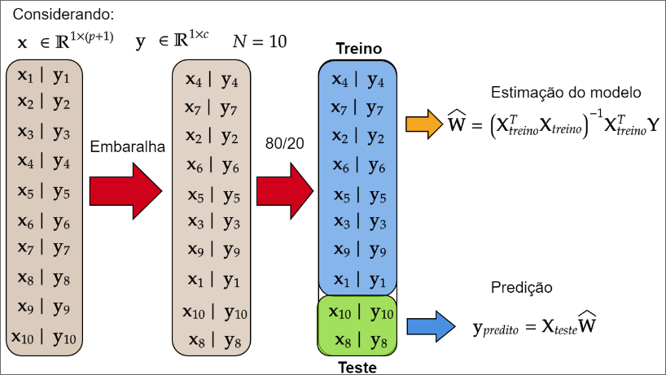

# Vertebral Column Classification

## Description

This project aims to develop a spinal data classification system using machine learning techniques in Python, with an additional approach using the Ordinary Least Squares Method. The main goal is to identify patterns in spinal data to predict possible problems or diseases.

## Dataset
  https://archive.ics.uci.edu/dataset/212/vertebral+column
